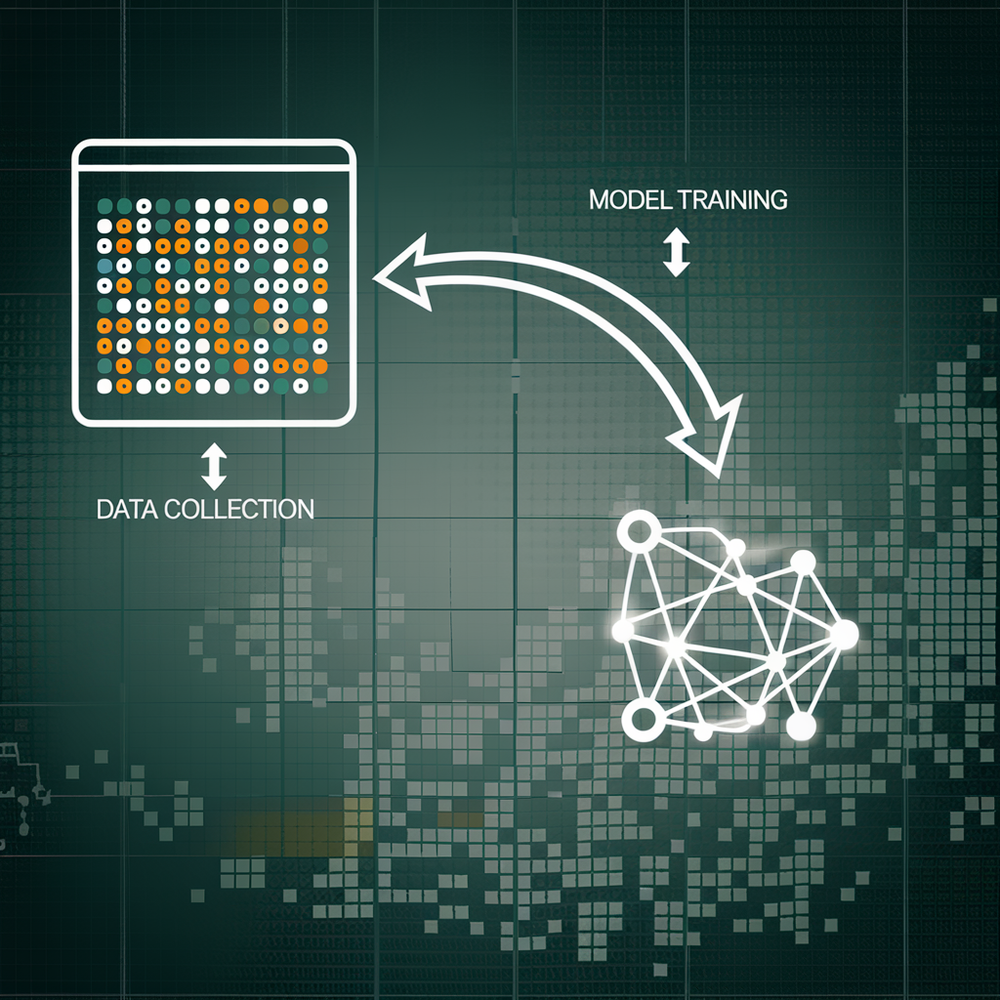

# Introduction to Data Acquisition, Data Mining, and Data Collection

## Introduction

"Data is the new oil." You've probably heard this phrase thrown around in tech circles. It's not just a catchy slogan—it’s a truth that underscores the value of data in our modern world. But just like oil, data in its raw form isn’t very useful. It needs to be discovered, collected, and refined before it can power the engines of AI, predictive analysis, or any kind of intelligent system.

Imagine you're about to embark on a journey, exploring a vast landscape of information, where each bit of data is a tiny clue leading you to a treasure trove of insights. But before you can find this treasure, you need to know how to navigate this landscape, how to gather your clues, and how to make sense of them. That’s where data acquisition, data collection, and data mining come in.

## 1. The Starting Point: What is Data?

Let’s start with the basics. Imagine you’re an artist, and data is your paint. It comes in different forms, colors, and textures, and it’s up to you to decide how to use it to create a masterpiece.

- **Structured data** is like a well-organized palette with clearly labeled colors—think of spreadsheets or databases where everything has its place.
- **Unstructured data**, on the other hand, is more like a messy studio with photos, videos, and random notes scattered everywhere.
- **Semi-structured data**—imagine a mix between the two, like a JSON file where you have some structure but still lots of freedom.

To make something meaningful out of all this, you need to know what type of data you’re dealing with and how to handle it.

### Data Sources: Where Does Data Come From?

Imagine a researcher conducting an experiment or a journalist interviewing sources. Data can come from various places, and it’s important to understand the differences:

- **Primary Data**: This is data you collect yourself through experiments, observations, or simulations. It’s like creating your own paint colors to get the exact shade you need.
- **Secondary Data**: This is data collected by someone else but used by you, like scraping information from websites or pulling from public databases. Think of this as using a pre-made paint set—you didn’t mix the colors, but you can still create something beautiful with them.

### Clean vs. Raw Data

Now, imagine you’ve just come back from a hike with a bunch of raw materials—sticks, stones, maybe even some gold nuggets. **Raw data** is like those materials: unprocessed, full of potential, but not quite ready to use.

Before you can work with raw data, you need to **clean** it. This means removing errors, filling in missing information, and ensuring consistency. Clean data is like refined gold—ready to be crafted into something valuable.

### Data File Formats

Different data types come in different formats. Knowing which format to use is like choosing the right brush for your painting:

- **CSV (Comma-Separated Values)**: Great for structured data, like spreadsheets.
- **JSON (JavaScript Object Notation)**: Perfect for semi-structured data, often used in web applications.
- **XML (eXtensible Markup Language)**: Used for structured data with a focus on hierarchical relationships.
- **TXT**: Simple text files, often used for unstructured data.

## 2. Data Acquisition: Gathering the Paint

Now, imagine you’re a detective. You need clues to solve your case, and those clues are scattered all over the place—some are in plain sight, while others are hidden away. **Data acquisition** is like gathering those clues from various sources.

- Maybe you tap into an **API**, like getting real-time updates from social media or weather services.
- Or perhaps you **scrape the web**, pulling information from websites just like you’d collect evidence from a crime scene.
- You might also pull data from **databases**, like searching through public records.
- And don’t forget about **sensors**—think of them as high-tech gadgets that collect data from the environment, like cameras or IoT devices.

The key here is to make sure the data you gather is relevant, accurate, and ethically sourced. Just like a detective needs reliable evidence to solve a case, you need good data to build a strong foundation for your analysis.

## 3. Data Collection: Organizing the Clues

Once you’ve gathered your clues, it’s time to organize them. Imagine you’re building a library. Before you start stacking books on the shelves, you need to decide what kind of books you need, where they’ll go, and how they’ll be cataloged. **Data collection** is a bit like that.

1. **Define Objectives**: What’s the purpose of this library? What kind of information do you need?
2. **Choose Methods**: Are you going to manually enter each book into the system, or will you use software to automate the process?
3. **Collect Data**: In this case, gathering all the books.
4. **Store Data**: Arrange your books neatly on the shelves, ready for anyone to access when needed.

Each step is crucial, and skipping one could lead to chaos, just like a library without any order.

## 4. Data Mining: Discovering the Insights

Now, let’s fast forward. Your library is fully stocked, and you’ve got all the clues you need. But how do you find the solution to your case? This is where **data mining** comes in—imagine it as digging through all the books, notes, and clues in your library to find the hidden patterns that will crack the case wide open.

**Data mining** involves several steps:

- **Data Cleaning**: Think of this as dusting off the old books, getting rid of anything irrelevant or incorrect.
- **Data Integration**: Like combining different clues to get a fuller picture.
- **Data Selection**: Focusing on the most relevant clues.
- **Data Transformation**: Translating those clues into something understandable.
- **Data Mining**: Analyzing the clues to find patterns or connections.
- **Evaluation**: Assessing the importance of those patterns—do they help solve the case?

By the end of this process, you’ve turned a collection of random data points into valuable insights, just like how a detective solves a case by piecing together clues.

## 5. The Bigger Picture: Why It All Matters

Imagine you’re an architect. You wouldn’t start building a skyscraper without first gathering the materials, drawing up plans, and laying a solid foundation. The same goes for working with AI, predictive analysis, or any advanced data-driven project.

By mastering data acquisition, data collection, and data mining, you’re essentially gathering your materials, organizing them, and finding the best way to use them. This foundation will ensure that when you start building your AI models or conducting predictive analysis, you’re working with the best possible data.

In the end, good data leads to good results, and that’s what we’re all aiming for.
